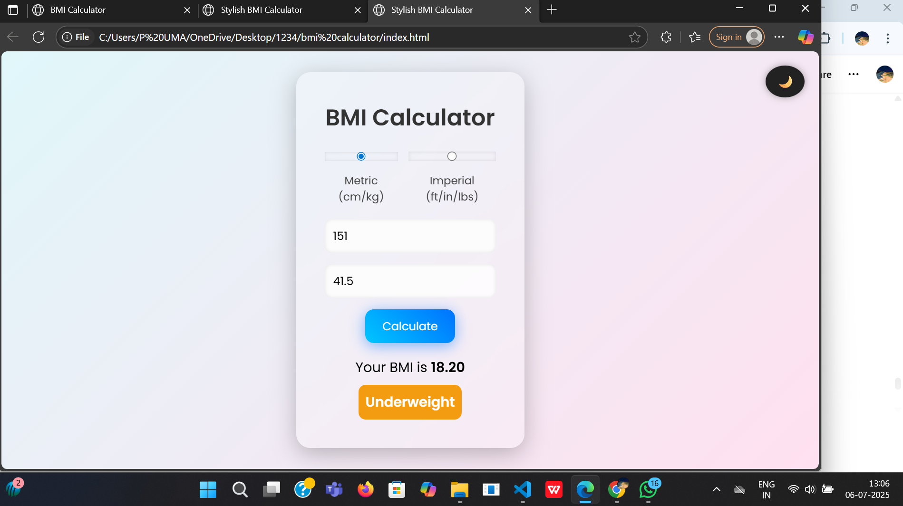

# 🌟 Stylish BMI Calculator (Web App)

A modern, responsive Body Mass Index (BMI) calculator with:
- 💎 Glassmorphism UI
- 🌙 Dark Mode toggle
- 📏 Unit conversion (cm/kg ↔ ft/in & lbs)
- 🔄 Loading animation
- 🔥 Mobile responsive design

## 🚀 Features
- Switch between **Metric** and **Imperial** units
- Color-coded BMI result: Underweight, Normal, Overweight, Obese
- Stylish UI with animations and gradients
- Works on all devices!

## 🛠 Tech Stack
- HTML, CSS (Glassmorphism, Animations)
- JavaScript (BMI logic, conversions)
- Deployed on [GitHub Pages][https://shailu0720.github.io/bmi-calculator/](https://shailu0720.github.io/bmi-calculator/)

## 📷 Preview

## 📦 How to Run
1. Clone the repo
2. Open `index.html` in any browser

## 📚 Learnings
- DOM manipulation
- CSS animations
- Responsive layout
- BMI math logic

## 🧑‍💻 Author
Made with ❤️ by P SHAILAJA
